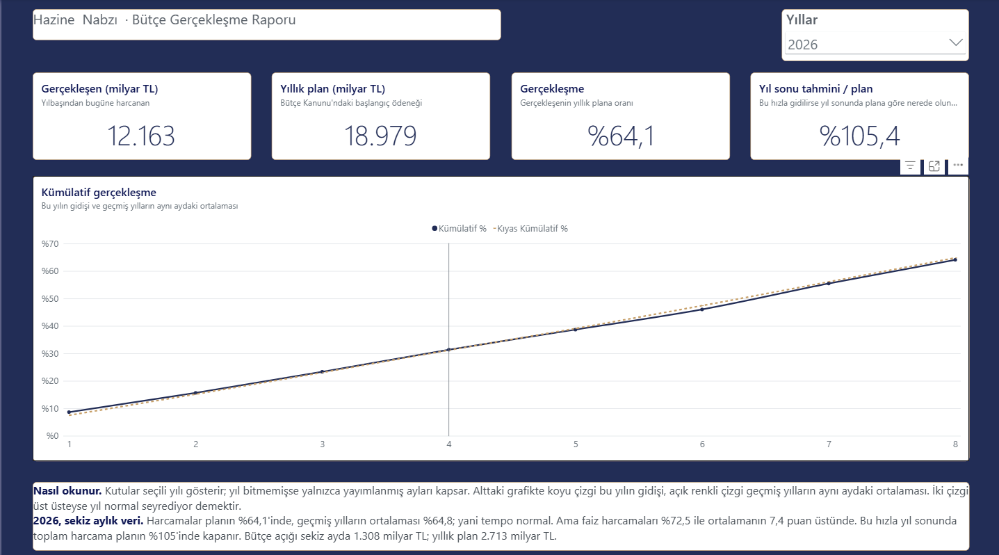
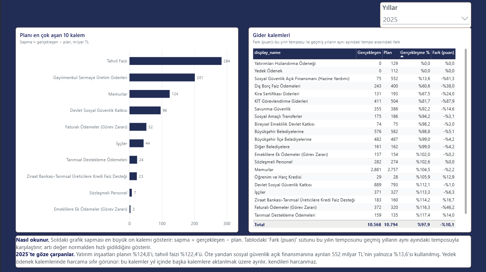
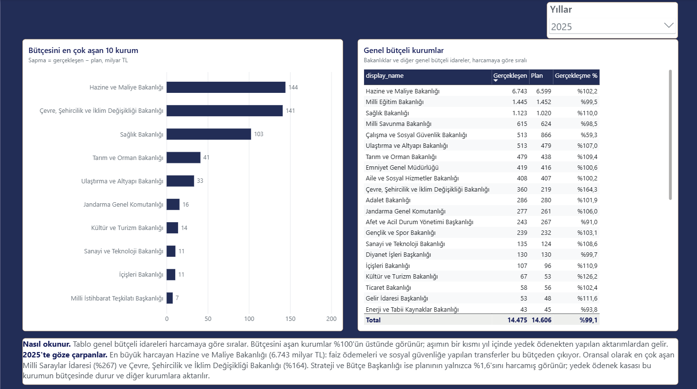
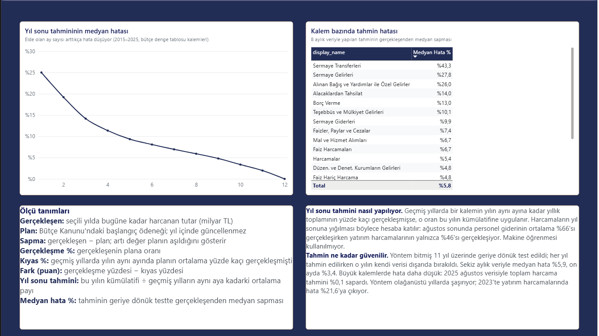
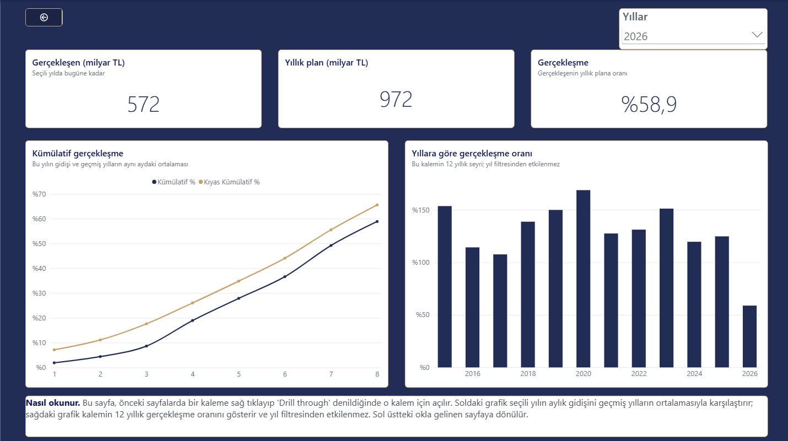

[English](README.md) | **Türkçe**

# Hazine Nabzı

> Proje yapım aşamasında. Bu dosya her gün, o günün işiyle birlikte doldurulacak.

Türkiye merkezi yönetim bütçesinde yıl başında planlanan tutarlarla ay ay gerçekleşen tutarları karşılaştıran, otomatik çalışan raporlama projesi.

## Ne yapıyor

Bir finans ekibinin her ay yaptığı işi otomatikleştiriyor: planlanan bütçe ile gerçekleşen harcamayı karşılaştırıyor, sapmaları buluyor ve raporluyor.

Veri, Hazine ve Maliye Bakanlığı Muhasebat Genel Müdürlüğü'nün her ay yayımladığı bütçe tabloları. Proje bu tabloları kendisi indiriyor, temizliyor, veritabanına yüklüyor ve Power BI raporuna dönüştürüyor.

Cevapladığı sorular:

1. Hangi harcama ve gelir kalemleri plandan en çok sapıyor?
2. Hangi bakanlık bütçesini aştı, hangisi altında kaldı?
3. Sapma yılın hangi ayında ortaya çıkıyor?
4. Bu tablo yıldan yıla tekrar ediyor mu?
5. Yılın ilk aylarına bakarak yıl sonu tahmin edilebilir mi?

## Veri

**Kaynak:** [Muhasebat Genel Müdürlüğü, Merkezi Yönetim Bütçe İstatistikleri](https://muhasebat.hmb.gov.tr/merkezi-yonetim-butce-istatistikleri).

**Kapsam:** 2015–2026, aylık. 2026 yılı yayımlanan son aya (Ağustos) kadar.

Her yıl için üç tablo kullanılıyor:

| Tablo | İçerik | Satır |
|---|---|---|
| Bütçe denge tablosu | Gelir ve giderin ana kalemleri, bütçe açığı | 23 kalem |
| Gider detay tablosu | Giderlerin alt kalemleri | 23 seçilmiş kalem ([`items.csv`](items.csv)) |
| Kurumsal tablo | Bakanlıklar ve diğer genel bütçeli kurumlar | 41–52 kurum |

Üç tabloda da her kalem için 12 ayın gerçekleşmesi ve yıl başındaki plan var. Plan, Meclis'in onayladığı Bütçe Kanunu'ndaki başlangıç ödeneği.

## Temizlik

36 ham Excel dosyası iki tabloya dönüştürüldü: `data/clean/actuals.csv` (aylık gerçekleşen, 13.728 satır) ve `data/clean/plans.csv` (yıllık plan, 1.174 satır).

Her satır tek bir ölçüm: bir kalemin, bir yıldaki ve o yıldaki spesifik bir aydaki tutarı.

| Sütun | İçerik |
|---|---|
| `source` | Satırın geldiği tablo: `balance`, `expense_detail`, `ministries` |
| `year`, `month` | Yıl ve ay (1–12). `plans.csv`'de ay yok, plan yıllık |
| `main_item` | Üst grup: Harcamalar / Gelirler / Denge, ana gider kalemi ya da Genel Bütçeli İdareler |
| `item` | Kalem ya da kurum adı |
| `amount_thousand_try` | Tutar, bin TL |

Tablolar yıldan yıla aynı formatta olmadığı için temizlikte çözülenler:

- **Sütunlar sırayla değil adıyla bulunuyor.** Bazı yıllarda fazladan sütun var, sıralar kayıyor. Plan sütununun adı 12 yılda yedi farklı şekilde yazılmıştı: "Bütçe Tahmini", "2022 Toplam Bütçe Tahmini*", "Bütçe Başlangıç Ödeneği *", "Toplam Bütçe Ödeneği*" gibi. Standart hale getirildi
- **Plan olarak başlangıç ödeneği alınıyor.** Kurumsal tabloda 2015–2024 arasında ikinci bir sütun daha var ("Ödenek Toplamı"): yıl içindeki aktarımlardan sonraki güncel ödenek. Diğer iki tabloda karşılığı olmadığı için kullanılmadı.
- **Ay adları bazı yıllarda kısaltılmış:** "Ocak" yerine "Oca", 2015'te Ağustos "Agu".
- **Kalem adları 2021'de değişmiş.** "KİT Görev Zararları" = "KİT Görevlendirme Giderleri" gibi yedi ad. Eski adlar [`items.csv`](items.csv) dosyasındaki `old_name` sütununda eşleştiriliyor.
- **Aynı ad tabloda birden çok kez geçebiliyor.** "Memurlar" hem personel hem sosyal güvenlik primi altında var; "Tahvil Faizi" iki yerde geçiyor ve biri boş. `items.csv`'deki `search_under` sütunu kalemin hangi başlığın altında aranacağını söylüyor.
- **Boş hücre iki anlama geliyor.** Bir ay tabloda herhangi bir kalemde doluysa o ay yayımlanmıştır ve boş hücre "harcama yok" demektir, 0 yazılır. Hiçbir kalemde dolu olmayan aylar henüz yayımlanmamıştır, tabloya girmez.
- **Kurumsal tabloda kurum listesinden sonra özet satırları var:** özel bütçeli idareler, düzenleyici kurumlar, merkezi yönetim toplamı. Okuma, kurum toplamı satırında bitiyor.
- **Kurum adlarının yazımı değişiyor:** "Hazine Ve Maliye" / "Hazine ve Maliye".

### Kontroller

`clean.py` her çalıştığında üç kontrolü yapıyor ve biri tutmazsa duruyor:

1. **Satır toplamı:** her satırda 12 ayın toplamı, dosyanın kendi "Toplam" sütununa eşit mi?
2. **Kurum toplamı:** okunan kurumların toplamı, tablodaki kurum toplamı satırına eşit mi?
3. **Mutabakat:** gider detay tablosundaki dokuz ana kalem, denge tablosundaki aynı kalemlerle aynı tutarı mı veriyor? İki tablo ayrı yayımlandığı için bu, doğru satırların okunduğunun bağımsız kanıtı. 1.368 nokta karşılaştırılıyor.

## Hesaplar

Sapma, kümülatif gerçekleşme ve tahmin hesapları veritabanında view olarak duruyor ([`sql/views.sql`](sql/views.sql)). Rapor, Excel çıktısı ve yönetim yorumu aynı görünümleri okur; hesap tek yerde yazılıdır.

| Görünüm | Bir satırı | Cevapladığı soru |
|---|---|---|
| `v_monthly` | Bir kalemin bir aydaki metrikleri: o ayki tutar, yılbaşından o aya kümülatif ve kümülatifin plana oranı | Yılın bu ayında planın yüzde kaçındayız? |
| `v_annual` | Bir kalemin bir yıldaki metrikleri: toplam, plan, sapma tutarı ve oranı | Yıl planın ne kadar üstünde kapandı? |
| `v_variance_rank` | Aynı satırlar, iki sıra numarasıyla: tutar olarak ve oran olarak sapma sıralaması | Planı en çok aşan kalemler ve kurumlar hangileri? |
| `v_year_end_forecast` | Bitmemiş yılın bir kalemi: bugüne kadarki tutar, yıl sonu tahmini ve tahminin plana oranı | Yıl bu gidişle nasıl kapanır? |
| `v_forecast_backtest` | Bitmiş bir yılın bir ayı: o ana kadarki veriyle yapılacak tahmin ve gerçekleşenden sapması | Tahmine ne kadar güvenilebilir? |

Rapor tarafı için iki filtre tablosu daha var ([`sql/dimensions.sql`](sql/dimensions.sql)): `dim_year` (yıl listesi) ve `dim_item` (kalem ve kurum listesi). Power BI'daki yıl ve kalem filtreleri bunlara bağlanıyor, hesap görünümleri de buradan filtreleniyor; yani model yıldız şema biçiminde kurulu. `dim_item` iki yardımcı sütun taşıyor: `display_name` kalem adını kaynak dosyadaki hiyerarşi işaretlerinden ("1.", "a)", "-") arındırıyor, `is_total` ise satırın bir toplam mı yoksa alt kalem mi olduğunu söylüyor. İkincisi olmadan grafiklerde aynı para iki kez sayılır, çünkü tablolarda toplamlar ve alt kalemler yan yana duruyor.

[`sql/procedures.sql`](sql/procedures.sql) içindeki `sp_monthly_report` yordamı, verilen yıl ve kaynak için raporun ana tablosunu tek çağrıda döndürür:

```sql
EXEC sp_monthly_report @year = 2026, @source = 'balance';
```

Örnek sorgular [`sql/examples.sql`](sql/examples.sql) dosyasında.

### Yıl sonu tahmini

Yöntem olarak rolling forecast mantığı kullanıldı. Geçmiş yıllarda bir kalemin yılın aynı ayına kadar yıllık toplamının yüzde kaçı gerçekleşmişse, bu oran bu yılın kümülatifine uygulanır. Harcamaların yıl sonuna yığılması böylece hesaba katılır: Ağustos sonuna kadar personel giderinin ortalama %66'sı gerçekleşirken, yatırım harcamalarının yalnızca %46'sı gerçekleşiyor.

Yöntem geriye dönük test edildi. Bitmiş her yıl için, o yılın kendi verisi dışarıda bırakılarak tahmin üretildi ve gerçekleşenle karşılaştırıldı (bütçe denge tablosu kalemleri, 2015–2025):

| Elde olan veri | Medyan hata |
|---|---|
| 4 ay | %11,4 |
| 6 ay | %8,1 |
| 8 ay | %5,9 |
| 10 ay | %3,4 |

Büyük kalemlerde hata daha düşük: 2025 yılı Ağustos verisiyle tahmin edilseydi toplam harcamada sapma %0,1, vergi gelirlerinde %1,0 olacaktı. Yöntem, olağanüstü yıllarda başarısız kalıyor. Örneğin 2023'teki öngürülemez deprem sebebiyle 2023'te yatırım harcamalarının tahmininde %21,6 oranında sapma oluşuyor.

## Kurulum

**Gerekenler:** Python 3.12+, SQL Server (2019 ve üstü; ücretsiz Express sürümü yeterli).

```bash
git clone <repo>
cd hazine-nabzi
python3 -m venv .venv
.venv/bin/pip install -r requirements.txt
```

Veritabanını ve kullanıcıyı bir kez oluşturun:

```sql
CREATE DATABASE hazine_nabzi;
CREATE LOGIN hazine WITH PASSWORD = '<şifre>', CHECK_POLICY = OFF;
USE hazine_nabzi;
CREATE USER hazine FOR LOGIN hazine;
ALTER ROLE db_owner ADD MEMBER hazine;
```

Bağlantı bilgilerini `.env` dosyasına yazın:

```bash
cp .env.example .env
```

SQL Server WSL dışında, Windows tarafında çalışıyorsa üç ayar gerekiyor: SQL kullanıcı girişi (mixed mode), TCP bağlantısı ve 1433 portu için güvenlik duvarı izni. `DB_SERVER` değeri de `localhost` değil, Windows'un WSL'den görünen adresi olmalı:

```bash
ip route show default | awk '{print $3}'
```

## Kullanım

Bütün akış tek komutla çalışır:

```bash
.venv/bin/python run.py
```

Sırayla indirir, temizler, veritabanına yükler ve hesapları uygular. Her adımın çıktısı hem ekrana hem `logs/<tarih>.log` dosyasına yazılır. Bir adım hata verirse akış orada durur; bozuk veri bir sonraki adıma geçmez.

Adımlar ayrı ayrı da çalıştırılabilir:

```bash
.venv/bin/python download.py   # Muhasebat'tan ham dosyaları indirir
.venv/bin/python clean.py      # temizleyip data/clean/ altına yazar, kontrolleri yapar
.venv/bin/python load.py       # temiz tabloları SQL Server'a yükler
.venv/bin/python apply_sql.py  # görünümleri ve yordamı veritabanına uygular
.venv/bin/python run.py --skip-download   # indirmeden, eldeki ham dosyalarla
```

### Aylık otomatik çalışma

Muhasebat verileri ayın ortasında yayımlıyor. Akış her ayın 20'sinde kendiliğinden çalışacak şekilde kuruldu; yeni ay verisi kendi iniyor, temizleniyor ve veritabanına yükleniyor.

Windows Görev Zamanlayıcı üzerinden, WSL içindeki komutu çağırarak:

```
schtasks /Create /TN "Hazine Nabzi - aylik guncelleme" ^
  /TR "wsl.exe -d Ubuntu -- /home/ataka/hazine-nabzi/.venv/bin/python /home/ataka/hazine-nabzi/run.py" ^
  /SC MONTHLY /D 20 /ST 09:00
```

## Rapor

Power BI raporu beş sayfadan oluşuyor. Veri doğrudan veritabanındaki görünümlerden geliyor; hesaplar raporda değil SQL tarafında yapılıyor, rapor yalnızca gösteriyor.



**Özet.** Seçili yılın dört göstergesi (gerçekleşen, plan, gerçekleşme oranı, yıl sonu tahmini) ve kümülatif gidiş grafiği. Grafikte lacivert çizgi bu yılın gidişi, altın çizgi geçmiş yılların aynı aydaki ortalaması. İki çizginin üst üste olması yılın normal seyrettiğini gösterir.



**Kalemler.** Planı en çok aşan kalemler ve gider kalemlerinin tam listesi. "Fark (puan)" sütunu bu yılın temposunu geçmiş yılların aynı ayındaki temposuyla karşılaştırır.



**Kurumlar.** Genel bütçeli idarelerin harcaması, planı ve gerçekleşme oranı; bütçesini en çok aşan kurumlar.



**Yöntem.** Yıl sonu tahmininin geriye dönük test sonuçları: ay ay medyan hata eğrisi ve kalem bazında hata tablosu. Sayfanın altında ölçü tanımları ve yöntemin anlatımı var. Rapordaki her sayının nasıl hesaplandığı bu sayfadan okunabilir.



**Kalem detayı.** Doğrudan açılmaz; Kalemler veya Kurumlar sayfasında bir kaleme sağ tıklayıp "Drill through" denildiğinde o kalem için açılır. Seçili yılın aylık gidişini ve kalemin 12 yıllık gerçekleşme oranını gösterir.

### Model

Rapor yıldız şema üzerine kurulu: iki filtre tablosu (`dim_year`, `dim_item`) ve üç ölçüm tablosu (`v_monthly`, `v_annual`, `v_year_end_forecast`) ile tahmin testini taşıyan `v_forecast_backtest`. Sekiz ilişkinin hepsi filtre tablolarından ölçüm tablolarına doğru tek yönlü. 12 DAX ölçüsü `Ölçüler` tablosunda toplanmış ve her birinin açıklaması modelde yazılı.

Rapor dosyası repoda `.pbip` (Power BI Project) biçiminde: tek bir ikili dosya yerine metin dosyalarından oluşan bir klasör. Böylece rapordaki değişiklikler git geçmişinde satır satır görünüyor. Renk düzeni [`powerbi/hazine-nabzi-theme.json`](powerbi/hazine-nabzi-theme.json) dosyasında ve Muhasebat'ın kurumsal renklerini kullanıyor.

## Proje yapısı

```
hazine-nabzi/
├── download.py        Muhasebat'tan 2015–2026 tablolarını indirir
├── clean.py           Ham dosyaları temizleyip iki tabloya çevirir, kontrolleri yapar
├── load.py            Temiz tabloları SQL Server'a yükler
├── apply_sql.py       sql/ altındaki görünüm ve yordamları veritabanına uygular
├── run.py             Bütün akışı tek komutla çalıştırır
├── xls_reader.py      Eski .xls dosyalarını okur (bozuk biçim kayıtlarını atlar)
├── items.csv          Gider detayından alınacak kalemler, eski adlarıyla birlikte
├── .env.example       Veritabanı bağlantı bilgilerinin örneği (.env repoya girmez)
├── requirements.txt   Gerekli Python kütüphaneleri
├── KURALLAR.md        Projenin çalışma kuralları ve günlüğü
├── powerbi/           Power BI raporu (.pbip) ve tema dosyası
├── docs/              Rapor ekran görüntüleri
├── sql/
│   ├── dimensions.sql Filtre tabloları: dim_year, dim_item
│   ├── views.sql      Rapor hesapları: beş görünüm
│   ├── procedures.sql Yönetim raporu yordamı
│   └── examples.sql   Örnek sorgular
├── data/
│   ├── raw/           İndirilen ham dosyalar (repoya dahil değil)
│   └── clean/         Temizlenmiş tablolar: actuals.csv, plans.csv
└── logs/              Çalıştırma kayıtları (repoya dahil değil)
```
